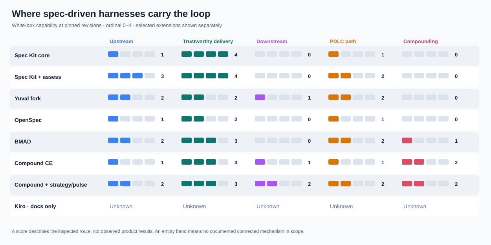

# White-box PDLC readiness of spec-driven harnesses

**Decision brief · 6 October 2026.** The strongest recurring pattern is reliable specification-to-code work with a weak return path from real use to the next investment decision. A CTO can usually rely on these tools to structure *delivery*; only a deliberately configured product loop can support an end-to-end PDLC claim. The first harness change is to make an outcome review, with an owner and trigger, a normal successor to shipping.

Scores are **ordinal 0–4 bands, not percentages or a league table**. `U` = upstream discovery; `T` = trustworthy SDLC delivery; `D` = downstream validation; `P` = connected PDLC path; `C` = compounding of the *harness*. `?` means the relevant installed behavior was not inspectable. These are documented/configured capabilities, not observed team results. The named optional combinations are assessed separately from the defaults.

| Inspected configuration | U | T | D | P | C | Confidence U/T/D/P/C | Dependable boundary | Most useful next harness move |
|---|---:|---:|---:|---:|---:|---|---|---|
| Spec Kit core, default | 1 | 4 | 0 | 1 | 0 | H/H/H/H/H | Spec/code convergence, then review or PR | Give post-launch success criteria an owner and review trigger |
| Spec Kit + `assess`, explicitly selected | 3 | 4 | 0 | 2 | 0 | H/H/H/M/H | Evidence-informed investment choice through PR | Carry the assessment decision into an owned outcome review |
| Yuval PDLC Spec Kit fork | 2 | 2 | 1 | 2 | 0 | H/M/M/M/H | LOFA-aware specification and optional evidence interpretation | Trigger `validate` after launch; assign owner/window/response |
| OpenSpec, default profile | 1 | 2 | 0 | 1 | 0 | H/H/H/H/H | Testable specs and task verification through archive | Make verification a required completion input, then add outcome review |
| BMAD, documented planning/build route | 2 | 3 | 0 | 2 | 1 | M/H/M/M/M | Product requirements and evidence-backed epic acceptance | Tie success metrics to a dated post-release decision |
| Compound Engineering, `ce-work` default | 1 | 3 | 1 | 1 | 2 | H/H/H/H/H | Reviewed, verified PR with an operational monitoring plan | Give the monitoring plan an actual post-release consumer |
| Compound + `ce-strategy` / configured `ce-product-pulse` | 2 | 3 | 2 | 2 | 2 | M/H/M/M/H | Strategy-linked metrics and repeatable pulse reports | Route pulse findings to a named investment or product decision |
| Kiro public documentation only | ? | ? | ? | ? | ? | — | Requirements/design/tasks and configurable hooks are documented; no installed configuration was supplied | Inspect a project `.kiro/` tree and active hook/steering settings |

`H` means the path and relevant owner files were inspectable; `M` means the score depends on a selected optional route or incomplete integration evidence. Neither denotes observed team performance.

**Comparator, not a market entry:** this repository's `flow-driven` definition would score **3 / 3 / 3 / 3 / 3** as a documented *configured* flow if its required evidence exits, decision log, adoption review, and evolve loop are selected. That is a capability benchmark; no live organizational outcome was observed. Its [evolve skill](../../skills/flow-driven-evolve/SKILL.md) requires cited probes, a human adoption decision, a versioned workflow change, a watch period, and kill criteria. The gap to band 4 is demonstrated repeated benefit across flows.

## Why the bands land here

**Spec Kit.** The core [converge command](https://github.com/github/spec-kit/blob/b1463da80bdba3cf6b019118ed499888758233d2/templates/commands/converge.md#L109-L114) deliberately excludes post-launch outcome metrics from its checks, then [routes a converged feature to review/PR](https://github.com/github/spec-kit/blob/b1463da80bdba3cf6b019118ed499888758233d2/templates/commands/converge.md#L210-L240). That is a strong correction loop for specified behavior and a clear product boundary. The [`assess` extension](https://github.com/github/spec-kit/blob/b1463da80bdba3cf6b019118ed499888758233d2/extensions/assess/README.md#L11-L47) adds research, options, and go/clarify/kill before `specify`, but it is an explicitly selected front end and still has no owned outcome-review successor. A team that installs it can improve investment quality; core users do not inherit that score.

**Yuval fork.** Its local, unmerged revision `cb644d4ed8fb1555761c366f4d3646e90c743bb6` requires [conviction and value/usability/feasibility/viability assumptions](/Users/yuvalyeret/Github/spec-kit-worktrees/spec-kit-yuval-pdlc/templates/spec-template.md:120) and offers [learning-oriented planning](/Users/yuvalyeret/Github/spec-kit-worktrees/spec-kit-yuval-pdlc/templates/commands/plan.md:149). [`validate`](/Users/yuvalyeret/Github/spec-kit-worktrees/spec-kit-yuval-pdlc/templates/commands/validate.md:20) can compare supplied real-world evidence to assumptions and suggest pivot/persevere/kill. No normal-path trigger, adoption owner, observation window, or human decision handoff was found; the fork's delivery path also lacks the newer core `converge` command. The two revisions share ancestor `3028a00b6e7b6ba568e49dcb816655894b5a633a`. This is **stronger product framing but less delivery convergence than the pinned newer core**, so the two columns should not be read as a controlled A/B test.

**OpenSpec.** Pinned public ZIP commit `2500d6da971336167548b53731a35b2127df35ac` (SHA-256 `286f20a7c4ef662a3e53b858a1f837e7cd33bf71eb3aaf2ce42b4d52dff64da6`). Its [default schema](https://github.com/Fission-AI/OpenSpec/blob/2500d6da971336167548b53731a35b2127df35ac/schemas/spec-driven/schema.yaml#L3-L22) connects proposal → testable specs → design → tasks, with per-task verification. [`explore` is optional](https://github.com/Fission-AI/OpenSpec/blob/2500d6da971336167548b53731a35b2127df35ac/docs/workflows.md#L35-L49), while [`verify` does not block archive](https://github.com/Fission-AI/OpenSpec/blob/2500d6da971336167548b53731a35b2127df35ac/docs/commands.md#L388-L450). Archive updates the spec record, not the workflow rules or product outcome decision.

**BMAD.** Pinned public source commit `8f2c13dd0e0073cad84168a679e5c553b2fb30b6`. Its [PRD template](https://github.com/bmad-code-org/BMAD-METHOD/blob/8f2c13dd0e0073cad84168a679e5c553b2fb30b6/skills/bmad-prd/assets/prd-template.md#L100-L113) links success and counter-metrics to requirements. The [epic finish process](https://github.com/bmad-code-org/BMAD-METHOD/blob/8f2c13dd0e0073cad84168a679e5c553b2fb30b6/docs/build/finish-an-epic.md#L8-L42) checks aggregate diffs, spec reconciliation, behavior, and acceptance; its [action items](https://github.com/bmad-code-org/BMAD-METHOD/blob/8f2c13dd0e0073cad84168a679e5c553b2fb30b6/docs/build/finish-an-epic.md#L85-L96) can feed development work. The inspected route ends at epic acceptance, and those action items do not by themselves version and test the harness. The upstream score reflects an *invoked planning route*, not a claim that every `bmad-build` run starts with discovery.

**Compound Engineering.** Pinned local checkout `4927d7a12a805351745e69c532f8d30f2bae3d8e`. The [`ce-work` shipping tail](https://github.com/everyinc/compound-engineering-plugin/blob/4927d7a12a805351745e69c532f8d30f2bae3d8e/skills/ce-work/references/shipping-workflow.md#L27-L79) requires review for non-mechanical changes, finding settlement, final validation, and an owner/window/signals in a PR monitoring plan. This catches many wrong implementations, but a plan in a PR is not a scheduled review. [`ce-compound`](https://github.com/everyinc/compound-engineering-plugin/blob/4927d7a12a805351745e69c532f8d30f2bae3d8e/skills/ce-compound/SKILL.md#L9-L28) builds a reusable solution library; it does not require a measured, versioned change to the harness. [`ce-strategy`](https://github.com/everyinc/compound-engineering-plugin/blob/4927d7a12a805351745e69c532f8d30f2bae3d8e/skills/ce-strategy/SKILL.md#L11-L13) can ground later planning, and a [configured pulse](https://github.com/everyinc/compound-engineering-plugin/blob/4927d7a12a805351745e69c532f8d30f2bae3d8e/skills/ce-product-pulse/SKILL.md#L43-L49) records signals. Neither is a mandatory successor to `ce-work` in the source inspected.

**Kiro.** The [official spec workflow](https://kiro.dev/docs/specs/feature-specs/tech-design-first/) describes requirements, design and tasks; [hooks](https://kiro.dev/docs/hooks/types/) can run checks after a task. These are public capability descriptions, not a selected project, agent mode, or installed configuration. An ordinal white-box score here would be false precision. Provide a `.kiro/` project tree or an exported effective configuration to score it.

## Three reusable harness changes

1. **Make outcome review an owned successor to delivery.** Evidence: most inspected routes stop at PR/archive/epic acceptance. Mechanism: a success metric written in a spec has no guaranteed consumer. Plausible effect: teams can ship correctly while repeating low-value investments. Add a required handoff containing beneficiary/cohort, baseline, leading signal, guardrail, review date, owner, and pivot/persevere/stop decision. **Owner:** product/engineering adoption lead. **Check:** in the next three material runs, each released item has a dated outcome review with a recorded decision and follow-up.
2. **Make quality evidence determine completion.** Evidence: OpenSpec verification is optional and warnings can accompany archive; the other delivery paths vary by version and selected commands. Mechanism: an agent can finish the task list without resolving a wrong-but-confident behavior. Add a risk-sized verification step whose evidence is reviewed independently and whose actionable findings route to correction or explicit accepted residuals. **Owner:** engineering quality lead. **Check:** replay one seeded mismatch; the path must prevent a clean completion claim and link the repair to a passing check.
3. **Turn captured learning into a falsifiable harness change.** Evidence: archives, retrospectives, pulses, and solution notes generally improve the artifact or product, while the harness instructions remain fixed. Mechanism: repeated failure patterns have no owned route into templates, checks, or routing. Add a small improvement queue with a baseline, owner, proposed rule change, versioned adoption, watch period, and kill/revert criterion. **Owner:** AI SDLC/PDLC harness owner. **Check:** one recurrent finding produces a changed instruction and a later-run comparison that keeps or reverts it.

## Source and method limits

The new [white-box skill](../../skills/pdlc-harness-readiness/SKILL.md) was run against pinned repository sources and a local fork; sources were read, not installed or executed. Framework brand names conceal multiple routes, so the table names a default or selected combination. We traced a material feature and checked the small-change routing where documented. Absence findings mean *no connected instruction in the inspected path*, not proof that a capable team cannot do the work. No team usage, product metrics, or actual run logs were available. Kiro is intentionally unscored until an effective configuration is inspectable.

The same skill also accepts a local coding-agent instruction hierarchy. In this repository, the checked-in [`AGENTS.md`](../../AGENTS.md) routes to `flow-driven`, requires evidence exits and human decisions, and routes workflow improvements through bets. It does **not** establish which global preferences or hidden vendor instructions ran in a particular Codex/Claude/Gemini session; those layers remain Unknown until the agent, working directory, loaded files, and active configuration are recorded. This configuration test verifies that the assessor can describe an instruction hierarchy without crediting a merely present skill as active.

An independent forward test on this repo's **repo-change overlay only** produced **0 / 3 / 0 / 0 / 2** for a material skill/script PR. It correctly identified the independent review and fix loop, kept the separately triggered portfolio lifecycle out of that PR score, and found that the mechanical frontmatter/reference checks lack runnable commands. The **effective Codex installation remains unscored** because its hidden baseline, other active plugins/hooks, and executed behavior were not fully inspected. This test exposed an ambiguity in partial-configuration scoring; the skill now requires a visibly bounded layer score and an Unknown effective-installation score.

**Next decision:** choose one active harness and name the owner of the post-release outcome review. The first three material runs provide the evidence to keep, tighten, or remove that handoff.
