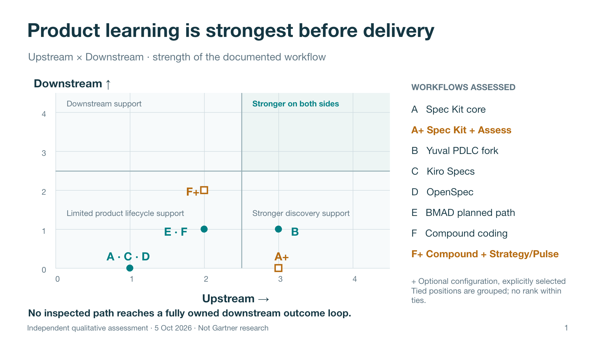
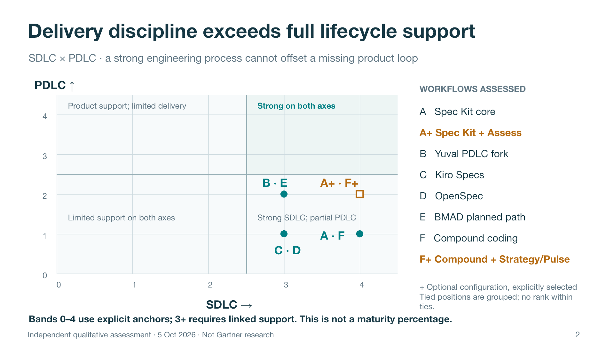

# Spec-driven frameworks: where the product lifecycle stops

**Executive finding:** The inspected paths all support software delivery. BMAD, the Yuval Spec Kit fork, optional Spec Kit Assess, and configured Compound Strategy/Product Pulse add meaningful product mechanisms. None establishes the full required intent → decision-relevant signal → adoption owner → human outcome decision → next action chain. This is a bounded finding about the inspected paths, not a claim that their users cannot run a complete PDLC.

**Recommended adoption move:** Keep the delivery workflow that suits the team. Add one product owner, one early value signal, an adoption handoff and a triggered continue/change/stop review to each material bet. Use an existing product process when it already supplies that contract.

## The two quadrant views

Read the horizontal axis first: **Upstream →**, with **Downstream ↑**, then **SDLC →**, with **PDLC ↑**. Greater support is right/up. The dividing line is between bands 2 and 3: partial mechanisms versus a stronger linked contract. Points with identical evidence bands are grouped; no jitter or invented precision separates ties. A plus sign denotes an optional configuration, not an automatic upgrade.

These are independent, qualitative quadrant diagrams, inspired by the requested format. They are not Gartner research, market leadership rankings, performance benchmarks, or equally spaced numerical measurements. The editable PowerPoint contains both diagrams and a final summary table.

### Positioning anchors

**Upstream**

- 0: No product framing in inspected scope
- 1: Problem/why and requirements framing
- 2: Repeatable outcome/option exploration; incomplete investment evidence
- 3: Structured discovery shapes a go/no-go or learning/delivery choice
- 4: Discovery, evidence thresholds and owned investment decisions form a complete linked contract

**Downstream**

- 0: Responsibility stops at engineering completion
- 1: Rollout/operations prompts or an ad hoc product-validation route
- 2: A concrete product-signal collection and review/reporting process
- 3: Adoption ownership plus triggered outcome decisions and routed follow-through
- 4: Recurring outcome decisions close the loop into subsequent investment and ongoing operation

**SDLC**

- 0: No delivery process established
- 1: Requirements or task guidance only
- 2: Linked requirements, implementation and basic checks
- 3: Structured execution plus acceptance/verification and change handling
- 4: Explicit corrective review/convergence loop with completion criteria

**PDLC**

- 0: No product intent established
- 1: Intent framing; delivery remains the completion boundary
- 2: Substantial discovery or product-evidence mechanisms; lifecycle links incomplete
- 3: Intent → signal → adoption owner → human outcome decision → next action is required
- 4: The complete contract recurs across investment, delivery and operation with learning routed forward

A band measures documented support in the stated path. It does not show whether the process was followed or produced business value. The seven-dimension profile below remains the primary assessment; a strong SDLC band never compensates for a missing product loop.

## Scope and fair comparison

Assessed 5 October 2026. Framework mode, read-only source inspection; no workflows installed or executed and no organizational adoption audited. Sources cover GitHub Spec Kit, Kiro Specs, OpenSpec, BMAD Method and Compound Engineering, plus the requested customized Spec Kit. This is a selected sample, not an exhaustive market ranking. GitHub API counts at retrieval were approximately 140k stars for Spec Kit, 71k for OpenSpec, 54k for BMAD and 25k for Compound Engineering; these justify the OSS sample, not any readiness rating. Kiro was explicitly requested; its issue-repository stars are not comparable adoption evidence. Repository links appear in the evidence below.

Default and optional configurations are separate rows. BMAD is explicitly its selected product-planning path; lightweight paths can differ. Community extensions, arbitrary custom hooks, and undocumented surrounding organizational processes are outside this quick assessment. A missing external process is unassessed, not proven nonexistent.

The original local Compound checkout remains untouched at `4927d7a12a805351745e69c532f8d30f2bae3d8e`. This comparison uses a separate latest-upstream source snapshot at `030188b4ba27f2dc33fbc4d5a112d3c8cc893e8c`; the earlier calibration of local post-deploy monitoring must not be generalized to this newer shipping contract.

## Findings, impact and smallest repair

### A · Spec Kit — upstream core

**SDLC-focused.** Technology-independent success criteria and a repeatable convergence loop preserve specification intent through implementation.

**Completion boundary:** Convergence compares software with spec, plan and tasks; a converged result proceeds to review/PR. Its inventory explicitly excludes post-launch business outcomes.

**Gap and consequence:** No required owner receives responsibility for adoption evidence or a post-launch product decision. Correct software can close the investment before anyone checks whether users gained the intended benefit.

**First move:** Link the spec to a named adoption owner and a dated outcome decision, using one observable user signal and a guardrail. Proposed accountable role: Product lead. **Proof of improvement:** A completed pilot review records evidence and an expand, revise or stop decision, linked back to the spec.

**Indicator read:** The spec template offers user-capability measures such as completion time and task success, alongside quality or later-result examples. These can be useful leading signals, but the core path does not require their cohort, collection window and investment response.

**Scope:** Default feature workflow; optional Assess excluded from this row. Snapshot: `b1463da80bdba3cf6b019118ed499888758233d2`. Confidence: High within inspected path.

**Evidence:** [Core convergence: scope and completion](https://github.com/github/spec-kit/blob/b1463da80bdba3cf6b019118ed499888758233d2/templates%2Fcommands%2Fconverge.md); [Spec template: success criteria](https://github.com/github/spec-kit/blob/b1463da80bdba3cf6b019118ed499888758233d2/templates%2Fspec-template.md).

### A+ · Spec Kit + Assess

**PDLC-aware; loop incomplete.** Intake, research, definition, shaping and a human-reviewed go/clarify/kill decision can reduce investment in weak ideas.

**Completion boundary:** An approved assessment hands off manually to specification. Assess is a separate workflow without lifecycle hooks.

**Gap and consequence:** The front-end investment decision has no matching outcome review after delivery. Better initial selection does not tell the sponsor when a once-plausible bet has stopped paying off.

**First move:** Carry the decision hypothesis and success signal from Assess into a release review with an accountable human. Proposed accountable role: Product sponsor. **Proof of improvement:** The first post-release decision explicitly revisits the original evidence and assumptions.

**Indicator read:** Assess Define asks for success metrics and a current or unknown baseline. This improves the starting question; the post-delivery collection owner, review timing and response remain unconnected.

**Scope:** Optional Assess installed and selected before core SDD. Snapshot: `b1463da80bdba3cf6b019118ed499888758233d2`. Confidence: High within inspected path.

**Evidence:** [Assess workflow boundary](https://github.com/github/spec-kit/blob/b1463da80bdba3cf6b019118ed499888758233d2/extensions%2Fassess%2FREADME.md); [Define: metrics and baseline](https://github.com/github/spec-kit/blob/b1463da80bdba3cf6b019118ed499888758233d2/extensions%2Fassess%2Fcommands%2Fspeckit.assess.define.md); [Decide: evidence and verdict](https://github.com/github/spec-kit/blob/b1463da80bdba3cf6b019118ed499888758233d2/extensions%2Fassess%2Fcommands%2Fspeckit.assess.decide.md); [Human review step](https://github.com/github/spec-kit/blob/b1463da80bdba3cf6b019118ed499888758233d2/workflows%2Fassess%2Fworkflow.yml).

### B · Spec Kit — Yuval PDLC fork

**PDLC-aware; loop incomplete.** Conviction and value/usability/feasibility/viability assumptions change the execution strategy. Validation consumes real-world evidence and can recommend a pivot or stop.

**Completion boundary:** A separate validation command can reopen specification; it is not an owned, automatically reached post-delivery review.

**Gap and consequence:** Adoption ownership, review timing and decision-ready indicator contracts remain unspecified. Teams can select a learning strategy yet finish delivery without settling the assumption that justified the work.

**First move:** Assign one product owner to carry the riskiest assumption through a bounded pilot, threshold-based review and recorded human decision. Proposed accountable role: Product owner. **Proof of improvement:** One complete spec-to-pilot-to-decision trace changes scope, investment or confidence on the basis of evidence.

**Indicator read:** Learning telemetry is tied to leap-of-faith assumptions, which is the right intent. The templates do not complete the population, baseline plan, evidence threshold and accountable response contract.

**Scope:** Customized specify/plan/tasks/implement/validate path. Snapshot: `cb644d4ed8fb1555761c366f4d3646e90c743bb6`. Confidence: High within inspected path.

**Evidence:** [Full local assessment and evidence](2026-10-05-spec-kit-pdlc-readiness.html).

### C · Kiro Specs

**SDLC-focused.** Requirements, design and implementation tasks provide a clear engineering sequence. IDE correctness properties add systematic checks of specified behavior.

**Completion boundary:** Task execution and correctness checks establish implementation conformance. User-configurable hooks extend automation but do not supply a product review contract.

**Gap and consequence:** The inspected Specs path does not carry product hypotheses, leading signals and an adoption/review owner beyond task completion. Excellent behavioral checks can validate the chosen solution without establishing that it solves a valuable problem.

**First move:** Add a linked intent and learning brief, then name the recipient and trigger for the post-launch outcome review. Proposed accountable role: Product and engineering leads. **Proof of improvement:** A spec links a customer assumption to a pilot signal and a documented continue/change decision.

**Indicator read:** Acceptance criteria and correctness properties describe behavior to verify. The inspected Specs documents do not require an early customer-value signal, its observation window or a product decision based on it.

**Scope:** Documented IDE feature-spec workflow, correctness and hooks; not every Kiro product capability. Snapshot: `Official docs retrieved 2026-10-05`. Confidence: Medium; official documentation, no configured installation or runtime audit.

**Evidence:** [Feature-spec sequence](https://kiro.dev/docs/specs/feature-specs/); [Correctness scope and IDE availability](https://kiro.dev/docs/specs/correctness/); [Configurable hooks](https://kiro.dev/docs/hooks/).

### D · OpenSpec

**SDLC-focused.** Proposals, behavioral scenarios and change archives keep implementation and a durable specification aligned. Optional verification checks completeness, correctness and coherence.

**Completion boundary:** Apply completes tasks; archive incorporates the change into long-lived specs. Verification is an additional workflow, and warnings do not necessarily block archiving.

**Gap and consequence:** The default artifacts explain why a change is wanted but do not require a product measurement or outcome decision after archive. A coherent history of delivered changes can accumulate without showing which changes improved user outcomes.

**First move:** Extend the change proposal with one outcome hypothesis and a linked post-adoption review; retain archive as the engineering record. Proposed accountable role: Product owner. **Proof of improvement:** An archived change points to evidence that led to scaling, revising or retiring the change.

**Indicator read:** Behavioral scenarios make software conformance observable. They do not by themselves define an adoption or value signal; the default proposal/spec artifacts have no required product-metric response contract.

**Scope:** Default spec-driven schema; explore/propose/apply/archive, with optional verification. Snapshot: `2500d6da971336167548b53731a35b2127df35ac`. Confidence: High within inspected path.

**Evidence:** [Default schema: proposal through apply](https://github.com/Fission-AI/OpenSpec/blob/2500d6da971336167548b53731a35b2127df35ac/schemas%2Fspec-driven%2Fschema.yaml); [Workflow profiles and archive](https://github.com/Fission-AI/OpenSpec/blob/2500d6da971336167548b53731a35b2127df35ac/docs%2Fworkflows.md); [Verify and archive behavior](https://github.com/Fission-AI/OpenSpec/blob/2500d6da971336167548b53731a35b2127df35ac/docs%2Fcommands.md).

### E · BMAD Method

**PDLC-aware; loop incomplete.** Product briefs and PRDs connect user pain, business success, assumptions and measurable success. The PRD adds countermetrics and risk-sensitive rollout/operations topics; course correction supports human-approved replanning.

**Completion boundary:** Epic retrospectives inspect integrated behavior and delivery evidence, feeding corrective tickets and a next-epic decision. They do not by themselves require customer-value evidence after launch.

**Gap and consequence:** Measurement and rollout prompts are not consistently connected to a named owner, review window and product investment response. A substantial planning and retrospective process can still judge success using delivery evidence while customer adoption remains unresolved.

**First move:** Carry one PRD success metric and countermetric into an owned adoption pilot, then bring its result into the next investment decision. Proposed accountable role: Product manager. **Proof of improvement:** An outcome review changes the next epic or the investment based on customer evidence, not just build quality.

**Indicator read:** The PRD asks for primary and secondary success metrics, definitions, targets and countermetrics, with measurement detail scaled to stakes. It does not consistently connect them to an early learning window and an owner authorized to change the investment.

**Scope:** Selected product-brief/PRD/spec/build/retrospective path; not a claim about every quick task. Snapshot: `8f2c13dd0e0073cad84168a679e5c553b2fb30b6`. Confidence: High within inspected path.

**Evidence:** [Discovery and research instructions](https://github.com/bmad-code-org/BMAD-METHOD/blob/8f2c13dd0e0073cad84168a679e5c553b2fb30b6/skills%2Fbmad-product-brief%2FSKILL.md); [Product brief template](https://github.com/bmad-code-org/BMAD-METHOD/blob/8f2c13dd0e0073cad84168a679e5c553b2fb30b6/skills%2Fbmad-product-brief%2Fassets%2Fbrief-template.md); [PRD success metrics and risk adaptations](https://github.com/bmad-code-org/BMAD-METHOD/blob/8f2c13dd0e0073cad84168a679e5c553b2fb30b6/skills%2Fbmad-prd%2Fassets%2Fprd-template.md); [Epic retrospective boundary](https://github.com/bmad-code-org/BMAD-METHOD/blob/8f2c13dd0e0073cad84168a679e5c553b2fb30b6/docs%2Fbuild%2Ffinish-an-epic.md); [Human-approved course correction](https://github.com/bmad-code-org/BMAD-METHOD/blob/8f2c13dd0e0073cad84168a679e5c553b2fb30b6/skills%2Fbmad-correct-course%2FSKILL.md).

### F · Compound Engineering — coding path

**SDLC-focused.** A unified plan separates outcomes from implementation means, preserves requirements and verification, and carries review findings through fixes and explicit shipping checks.

**Completion boundary:** The inspected shipping contract ends with reviewed work and commit/PR. Operational considerations may enter the plan when material; engineering learning is captured separately.

**Gap and consequence:** An outcome-shaped objective does not automatically connect shipped work to adoption evidence and a product decision. Teams can improve how they deliver each change while learning too little about which changes deserve continued investment.

**First move:** Add an explicit product handoff to the plan; connect a configured Product Pulse to an owner who must respond. Proposed accountable role: Product lead. **Proof of improvement:** A shipped plan links to a signal review and a recorded change to product direction or scope.

**Indicator read:** The plan distinguishes a user-checkable outcome from implementation means and can add success criteria. Engineering verification demonstrates conformance; no required timely product-signal collection and response follows shipping.

**Scope:** Brainstorm/plan/work/review/compound; Strategy and Product Pulse not assumed configured. Snapshot: `030188b4ba27f2dc33fbc4d5a112d3c8cc893e8c`. Confidence: High within inspected path.

**Evidence:** [Unified plan: objective, product and verification contracts](https://github.com/EveryInc/compound-engineering-plugin/blob/030188b4ba27f2dc33fbc4d5a112d3c8cc893e8c/skills%2Fce-plan%2Freferences%2Fplan-sections.md); [Shipping: review, fixes and completion](https://github.com/EveryInc/compound-engineering-plugin/blob/030188b4ba27f2dc33fbc4d5a112d3c8cc893e8c/skills%2Fce-work%2Freferences%2Fshipping-workflow.md).

### F+ · Compound + Strategy / Product Pulse

**PDLC-aware; loop incomplete.** Strategy supplies purpose, users, boundaries and metric sources. Product Pulse distinguishes engagement from value realization, queries real signals and can be scheduled when requested.

**Completion boundary:** The pulse produces a short report and follow-up questions. A metric report does not itself assign a threshold-based investment decision or adoption responsibility.

**Gap and consequence:** The evidence collection path is usable; the accountable interpretation and act-on-results path is incomplete. More timely evidence may become another report unless someone is responsible for changing the bet when results disappoint.

**First move:** Name a product decision owner, review cadence and response rules for the primary value signal, including inconclusive evidence. Proposed accountable role: Product sponsor. **Proof of improvement:** Two consecutive pulses lead to explicit continue, investigate, revise or stop decisions with follow-through.

**Indicator read:** The Pulse interview distinguishes engagement from value realization and asks what would be actionable if a signal moves. Its configured queries and time window are substantial strengths. Baselines, response thresholds and an accountable product decision still need an explicit contract.

**Scope:** Optional strategy and analytics skills explicitly selected and configured alongside coding. Snapshot: `030188b4ba27f2dc33fbc4d5a112d3c8cc893e8c`. Confidence: High within inspected path.

**Evidence:** [Strategy contract](https://github.com/EveryInc/compound-engineering-plugin/blob/030188b4ba27f2dc33fbc4d5a112d3c8cc893e8c/skills%2Fce-strategy%2FSKILL.md); [Strategy metric definitions](https://github.com/EveryInc/compound-engineering-plugin/blob/030188b4ba27f2dc33fbc4d5a112d3c8cc893e8c/skills%2Fce-strategy%2Freferences%2Fstrategy-template.md); [Pulse setup and activation](https://github.com/EveryInc/compound-engineering-plugin/blob/030188b4ba27f2dc33fbc4d5a112d3c8cc893e8c/skills%2Fce-product-pulse%2FSKILL.md); [Signal selection interview](https://github.com/EveryInc/compound-engineering-plugin/blob/030188b4ba27f2dc33fbc4d5a112d3c8cc893e8c/skills%2Fce-product-pulse%2Freferences%2Finterview.md); [Pulse outputs and follow-ups](https://github.com/EveryInc/compound-engineering-plugin/blob/030188b4ba27f2dc33fbc4d5a112d3c8cc893e8c/skills%2Fce-product-pulse%2Freferences%2Frun.md).

## What the Yuval fork comparison actually shows

The custom branch is preserved at `cb644d4`; clean upstream main is `b1463da`. Their common ancestor is `3028a00b6e7b6ba568e49dcb816655894b5a633a`. The fork has two unique commits; current upstream has 1,378 since that common ancestor. This is not a controlled same-base experiment.

The local diff verifies the fork’s added conviction, leap-of-faith assumptions, learning-versus-delivery strategy and real-world validation command. Those additions explain its stronger product-learning support relative to the core engineering path. Current upstream independently adds optional Assess and more explicit engineering convergence. The comparison does not show that the fork beats every capability of today’s distribution, nor that either produces better measured outcomes.

The most useful next change is an owned adoption-to-validation handoff. Porting the fork onto current upstream is a separate engineering decision; it was not done here. See the [custom report](2026-10-05-spec-kit-pdlc-readiness.html) and [clean-upstream report](2026-10-05-spec-kit-upstream-pdlc-readiness.html).

## Seven-dimension evidence profile

Supported means required, linked support within the selected path, not observed execution. Partial means meaningful but incomplete or optional support. Gap means the inspected path ends without the necessary contract. Kiro’s documentation-only scope lowers confidence. Product metrics with targets still receive Partial when timely interpretation, ownership or response are missing.

| Path | Intent | Discovery | Indicators | Decisions | Delivery | Adoption | Outcome review |
|---|---|---|---|---|---|---|---|
| A Spec Kit core | Supported | Partial | Partial | Partial | Supported | Gap | Gap |
| A+ Spec Kit + Assess | Supported | Supported | Partial | Supported | Supported | Gap | Gap |
| B Yuval PDLC fork | Supported | Supported | Partial | Partial | Supported | Gap | Partial |
| C Kiro Specs | Partial | Partial | Gap | Partial | Supported | Gap | Gap |
| D OpenSpec | Partial | Partial | Gap | Partial | Supported | Gap | Gap |
| E BMAD planned path | Supported | Partial | Partial | Partial | Supported | Partial | Partial |
| F Compound coding | Supported | Partial | Partial | Partial | Supported | Partial | Gap |
| F+ Compound + Strategy/Pulse | Supported | Partial | Partial | Partial | Supported | Partial | Partial |

## Summary table

| Framework / configuration | What leaders can rely on | Principal gap / business risk | Up / Down | SDLC / PDLC | Overall read |
|---|---|---|---|---|---|
| A Spec Kit core | Spec and implementation alignment | No owned outcome review; correct but low-value work can close | 1 / 0 | 4 / 1 | SDLC-focused |
| A+ Spec Kit + Assess | Evidence-backed front-end decision | Post-launch bet is not revisited | 3 / 0 | 4 / 2 | PDLC-aware; loop incomplete |
| B Yuval PDLC fork | Assumption-driven learning and validation | Optional validation can remain unused | 3 / 1 | 3 / 2 | PDLC-aware; loop incomplete |
| C Kiro Specs | Structured specs and correctness checks | Conformance can stand in for product value | 1 / 0 | 3 / 1 | SDLC-focused |
| D OpenSpec | Living specs and disciplined change | Archive does not establish user benefit | 1 / 0 | 3 / 1 | SDLC-focused |
| E BMAD planned path | Product planning and delivery retrospectives | Customer evidence may not affect next investment | 2 / 1 | 3 / 2 | PDLC-aware; loop incomplete |
| F Compound coding | Outcome intent, review and corrective delivery | Engineering learning can miss product learning | 2 / 1 | 4 / 1 | SDLC-focused |
| F+ Compound + Strategy/Pulse | Strategy plus actual product-signal reporting | Reports lack an accountable decision response | 2 / 2 | 4 / 2 | PDLC-aware; loop incomplete |
