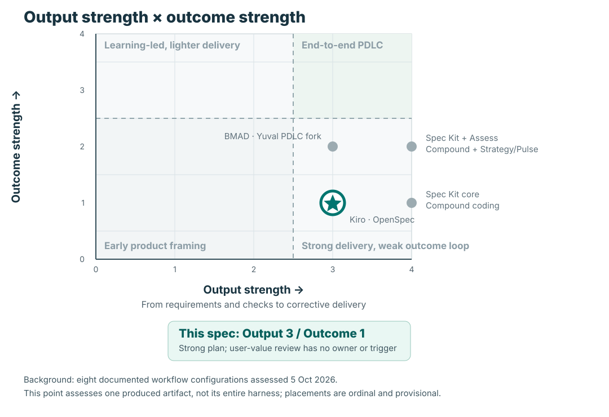

# PDLC readiness — Issues Analytics plan

**SDLC-focused — clear product intent and strong delivery planning; completion stops before demonstrated user value.**

The written contract carries work through implementation, automated checks, a local browser check, and a latency comparison. It assigns no recipient or trigger for adoption and outcome review. The /goal loop stops at technical completion. [E1]

Black-box artifact assessment · 6 October 2026 · provisional Plan/Commit → Deliver · high confidence in the written completion boundary; medium confidence in wider lifecycle coverage. The plan identifies `ce-unified-plan/v1` and `ce-brainstorm` as its producing contract and source. Harness scores below describe what **this output demonstrates**, not the capabilities of Compound Engineering as a whole or actual team practice. [E1, E2]

## Visual benchmark — output and outcome strength

**This spec: Output 3/4 · Outcome 1/4 (provisional).** Output 3 means structured requirements, implementation units, and verification, but no explicit corrective convergence cycle. Outcome 1 means product intent is visible, while the written completion boundary remains technical delivery. These are **ordinal evidence bands**, not a maturity percentage. [E1–E3]

The gray points reuse the [5 October framework comparison](2026-10-05-framework-comparison-data.json): Spec Kit core and Compound coding (4,1); Spec Kit + Assess and Compound + Strategy/Pulse (4,2); BMAD and the Yuval PDLC fork (3,2); Kiro and OpenSpec (3,1). Optional configurations are shown separately. They are benchmark context from inspected framework paths; the foreground point is one produced spec, so this is not a controlled, like-for-like ranking or a verdict on the producing harness. The dividing line is between bands 2 and 3; none of the inspected paths had a complete outcome loop. [B1]

## Lifecycle and strengths

Explore: **Supported** | Discover: **Partial** | Commit: **Partial** | Deliver: **Supported** | Adopt: **Gap** | Review outcomes: **Gap** | Adapt & operate: **Gap**

Explore maps to intent; Discover to assumptions; Commit and Deliver to their matching dimensions. Adopt maps to adoption; Adapt & operate combines the missing operating and outcome-response contracts. No return from real-use evidence to Explore/Discover is specified. Supported means documented support, not executed success.

**Keep**

- Concrete problem: PR-linked issue data excludes unresolved and unlinked demand; the proposed scope addresses that blind spot. [E2, E6]

- Requirements map to acceptance examples and implementation units, with regression, fail-soft, browser, and latency checks. These are planned checks, not passing results. [E1, E3]

- Explicit scope choices, sample-limit warnings, and reuse of the existing app keep the feature bounded. [E2, E4]

The leadership question is whether the producing workflow would reliably ask for and carry those missing product decisions into the next spec. One output can reveal a failure mode, but cannot establish its frequency or root cause.

## Producing-harness yield scorecard

| What this output tests | Demonstrated score | Black-box evidence and implication |
|---|---:|---|
| Intent carried into the plan | 2/2 | A concrete user capability and problem survive into scope and requirements. Preserve this behavior. [E2] |
| Decision-relevant learning signal | 1/2 | The three named “leading indicators” test data, tests, and latency; none observes whether a user makes a better backlog decision. [E3] |
| Adoption and operating handoff | 0/2 | No pilot recipient, access/support owner, or first-use trigger appears in the completion contract. [E1, E7] |
| Outcome decision and feedback | 0/2 | The /goal loop stops when implementation checks pass, with no real-use review or route back into scope. [E1] |
| Delivery execution and verification | 2/2 | Requirements, units, acceptance examples, and checks are linked; an R2/deferred-scope conflict still needs repair. [E1, E5] |

**How to read the score:** 0 = no demonstrated contract, 1 = partial, 2 = explicit and connected in this output. This is a *yield profile*, not a score of the underlying tool, team, or every plan it produces. Confidence is high for the observed output and low for whether the omissions are systemic. A sample of additional outputs and the actual harness instructions would resolve that uncertainty.

## Dimension profile

| Dimension | State | Evidence and interpretation |
|---|---|---|
| Intent and outcome | Supported | A user capability and the missing-demand problem are explicit; scope is bounded. The first pilot cohort still needs naming. [E2] |
| Assumptions and discovery | Partial | Technical assumptions and one reported API probe exist; no probe tests whether the displayed evidence supports a useful user decision. Probe results were not supplied. [E4] |
| Leading indicators | Partial | Payload completeness, tests, and latency support delivery confidence; no user-task signal has an owner and response rule. [E3] |
| Commitment and decisions | Partial | User-directed scope decisions are recorded. A responsible human and evidence trigger for continue/revise/stop are unspecified. [E2, E1] |
| Delivery and verification | Supported | Requirement-to-unit traceability and explicit verification support implementation. Resolve the refresh-scope inconsistency before treating every requirement as covered. [E1, E5] |
| Adoption and operation | Gap | The inspected completion contract has no pilot recipient, release/access handoff, support owner, or ongoing issue-data failure review. [E1, E7] |
| Outcome review and adaptation | Gap | The loop terminates on technical success; no real-use evidence review routes a human decision back into work. [E1, E7] |

## 1. Recommendations for this spec

### 1. Close the responsibility gap after delivery

The live-app scope is clear, but the Definition of Done and loop specify no user handoff or subsequent review. The earlier web-app plan also ends at functional verification. [E1, E7]

**Plausible consequence:** The feature could work and still go unused, with nobody responsible for discovering that.

**Smallest repair:** Extend the existing completion contract with pilot access, one responsible human, a first-use review, and keep/revise/stop routing. A separate rollout programme is unnecessary for this bounded feature.

Proposed product owner: Yuval or a delegate. Proof: a dated review records an actual user decision, limitations, and the resulting next action.

### 2. Test the capability the user is buying

Twenty populated weeks, named tests, and acceptable latency do not establish that someone can interpret backlog health. The plan supplies no observed user-task evidence. [E2, E3]

**Plausible consequence:** A technically green dashboard could produce confident but unhelpful backlog advice.

**Smallest repair:** Use one thin working slice in a real backlog review. Compare the user’s assessment with the current PR-only view; record what additional evidence changed or confirmed the decision and whether the user understood its limits.

Proposed pilot owner: product owner with one intended user. Proof: an observed task and decision record, reviewed before extending feature scope. This is a proposed learning contract, not an agreed target.

### 3. Establish what the measurements can support

The plan acknowledges capped samples, but pairs them with a fixed 20-week target and “full stale count.” Its stale definition is comment inactivity, and its objective says “never gets resolved.” These limits are not carried explicitly into U4’s chat-context contract. [E2, E3, E4]

**Plausible consequence:** Users could mistake a partial count or a finite observation window for a complete diagnosis. No misleading result has been observed in this assessment.

**Smallest repair:** Before the pilot, record actual coverage and latency on the target repo; define sampled versus complete counts and “still unresolved as of” language; pass the same limitations to charts and chat. If 20 reliable weeks are unavailable, the human owner chooses wider collection or a narrower claim.

Proposed owners: implementer supplies evidence; product owner accepts the claim. Proof: the pilot report and chat answer expose the same observation window and limitations.

## 2. Prioritized improvements to the producing spec-driven harness

These are **change hypotheses for the workflow that produced this plan**, inferred from its black-box output. They do not claim that Compound Engineering lacks these capabilities. First inspect the local `ce-unified-plan/v1` instructions and any linked product process; if an existing step already supplies a contract, connect it rather than duplicate it. [E1, E2]

| Priority | Harness yield now | Recommended change | Why it matters / proof on the next run |
|---|---|---|---|
| **P1 — Require an owned post-delivery handoff** | Adoption 0/2; outcome response 0/2 | Make every material plan name the recipient, first-use or release trigger, review owner, evidence window, and human keep/revise/stop decision, or link to an existing process that does. The /goal completion text should hand off responsibility rather than imply that green checks close the product bet. | Highest impact: this output can reach “done” before anyone checks user value. A subsequent plan should contain an explicit handoff that remains traceable through delivery; a dated pilot review should show the decision. [E1, E7] |
| **P2 — Separate learning signals from delivery checks** | Learning signal 1/2 | Keep technical checks, but require one decision-relevant user or beneficiary signal, its baseline/probe, observation window, interpretation rule, and accountable response. Label tests, payload counts, and latency as delivery evidence or guardrails unless a causal link is argued. | Prevents an impressive indicator list from substituting for product learning. The next comparable plan should explain which observed behavior could change the investment decision and when. [E2, E3] |
| **P3 — Check claim integrity before plan closure** | Delivery 2/2, with a scope conflict | Add a final cross-check among requirements, deferrals, sample limits, UI/chat claims, and verification. Route unresolved contradictions to a human choice before execution. | Lower confidence as a systemic issue from one artifact, but the R2 contradiction and “full” versus capped counts could mislead implementation or users. Proof is a resolved scope statement and consistent coverage language across the next plan's surfaces. [E4, E5] |

**Validation of the harness change:** after editing the workflow, assess three newly produced material specs using the same yield profile. Look for owned handoffs and decision-ready signals in the outputs, not merely new template headings. Review exceptions for low-risk work explicitly. Until then, the priority order is a recommendation based on this one plan and its earlier web-app context, not a measured defect rate. [E1, E7]

## Indicator read

| Signal | Role | What it supports |
|---|---|---|
| ≥20 weekly points; non-null R3–R7 | Delivery/data-quality proxy | Tests availability, not completeness, representativeness, or interpretation. The capped sample may shorten the usable window; feasibility of 20 weeks remains unverified. [E3, E4] |
| AE1–AE3 named tests pass | Delivery/quality | Useful evidence of specified arithmetic and behavior; no evidence of user decision quality. [E3] |
| Analyze time increases ≤15 seconds | Performance guardrail | A relevant usability constraint with a same-repo baseline procedure, but no measured baseline/result supplied. [E3] |

Proposed primary learning signal: at the first pilot backlog review, can the intended user identify whether observed demand exceeds resolutions, select an evidence-backed next action, and state the data limitations? Record performance on the current view first. The product owner reviews the observed task immediately: continue if the evidence supports the decision; revise if interpretation fails; gather more evidence if inconclusive. Retain latency and correctness checks as guardrails. A single-user pilot is directional evidence, not adoption proof.

The dashboard’s cycle time, arrival/resolution, age, and stale metrics are product content. Their presence alone does not measure whether this feature helps its users. No revenue proxy or enterprise portfolio ceremony is required.

## Evidence and limits

- Input snapshot: github-analytics HEAD 06b579ed8a28739e09e0da0ee464d59fc8c13318, branch claude/workflows-issues-analytics-eb07e9; docs/ untracked. Plan SHA-256: d2a58959a941cdd49ee79684372efc2d30b149c56cdd5768f446025bd3757465.

- Stage is provisional: implementation units name new files, the inspected checkout has no issues.py or issue tests, and no execution evidence was supplied. No claim is made about other branches or deployed environments.

- Coverage: full target plan; README; earlier web-app plan; selected analyze.py and app.py passages. No linked adoption/review document is named. The ce-brainstorm source and underlying user conversation/API-probe record were not available in this snapshot: their evidence is Unknown, not disproven.

- The R2 force-refresh requirement conflicts with its explicit web-path deferral. Existing app.py:89–93 always calls collect_data. Clarify the intended scope; this assessment does not prescribe a cache redesign. [E5]

- No live GitHub calls, app execution, implementation tests, user study, or external process audit were performed. Future-stage gaps concern missing ownership/trigger contracts, not a demand for pre-launch outcome results.

- Skill: pdlc-readiness v1.0.0 for the original artifact read; v1.1.0 adds black-box harness hypotheses and benchmark context. This is not a repository audit of the producing framework.

- **B1** — [Framework comparison data, 5 October 2026](2026-10-05-framework-comparison-data.json), `sdlc` and `pdlc` ordinal bands; anchors and limitations in [comparison method](../../skills/pdlc-readiness/references/comparisons.md). The eight positions are unchanged from that assessment.

- **E1** — [2026-10-06-0619-feat-issues-analytics-plan.md:199–222](/Users/yuvalyeret/Github/github-analytics/.claude/worktrees/workflows-issues-analytics-eb07e9/docs/plans/2026-10-06-0619-feat-issues-analytics-plan.md:199), Verification Contract; Definition of Done; Suggested /goal Loop Prompt. Excerpt: “Stop when all three hold and the Definition of Done is met”.

- **E2** — [2026-10-06-0619-feat-issues-analytics-plan.md:13–80](/Users/yuvalyeret/Github/github-analytics/.claude/worktrees/workflows-issues-analytics-eb07e9/docs/plans/2026-10-06-0619-feat-issues-analytics-plan.md:13), Goal Capsule; Problem Frame; Key Decisions; Product Contract. Excerpt: “A user analyzing a repo can see whether its issue backlog is healthy”.

- **E3** — [2026-10-06-0619-feat-issues-analytics-plan.md:19–22](/Users/yuvalyeret/Github/github-analytics/.claude/worktrees/workflows-issues-analytics-eb07e9/docs/plans/2026-10-06-0619-feat-issues-analytics-plan.md:19), Leading indicators (measurement procedures at lines 199–208). Excerpt: “at least 20 weekly points and no null R3-R7 fields”.

- **E4** — [2026-10-06-0619-feat-issues-analytics-plan.md:86–123](/Users/yuvalyeret/Github/github-analytics/.claude/worktrees/workflows-issues-analytics-eb07e9/docs/plans/2026-10-06-0619-feat-issues-analytics-plan.md:86), KTD2–KTD7; Assumptions; Risks (chat consumer at lines 175–184). Excerpt: “The payload carries the full stale count and the 25 oldest items.”.

- **E5** — [2026-10-06-0619-feat-issues-analytics-plan.md:49–78](/Users/yuvalyeret/Github/github-analytics/.claude/worktrees/workflows-issues-analytics-eb07e9/docs/plans/2026-10-06-0619-feat-issues-analytics-plan.md:49), R2 versus Deferred to Follow-Up Work; corroborated by app.py:89–93. Excerpt: “Honoring `force_refresh` in the web app path”.

- **E6** — [analyze.py:452–458](/Users/yuvalyeret/Github/github-analytics/.claude/worktrees/workflows-issues-analytics-eb07e9/analyze.py:452), Existing issue linkage; compute_flow_metrics at lines 533–564. Excerpt: “closingIssuesReferences”.

- **E7** — [converting-github-analytics-to-a-live-web-app-implementation-plan.md:1–end](/Users/yuvalyeret/Github/github-analytics/.claude/worktrees/workflows-issues-analytics-eb07e9/converting-github-analytics-to-a-live-web-app-implementation-plan.md:1), Earlier web-app plan, Verification Plan; README reviewed for parent context. Excerpt: “Manual Verification”.

## Next decision

Recommendation: update the producing plan contract so a bounded pilot and owned outcome review are a visible handoff, then repair this spec before treating the feature as a completed product bet. Proposed decision owner: Yuval or a designated product owner. Improvement is demonstrated when the next generated plans carry that contract and real use produces a recorded backlog decision with a keep/revise/stop response. No implementation or workflow decision is authorized by this assessment.
