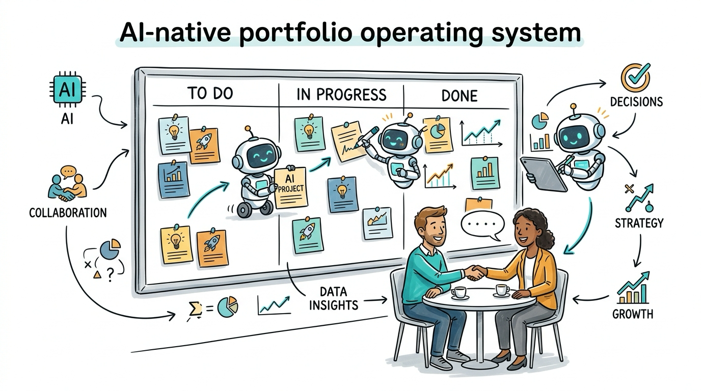
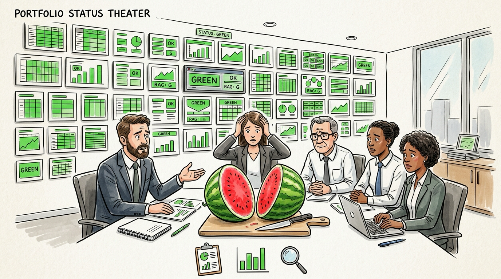
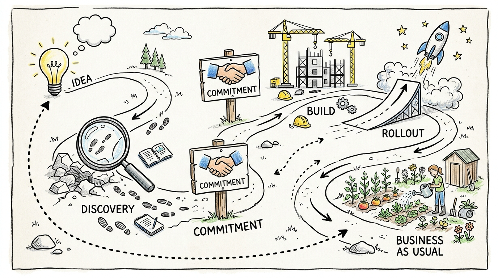
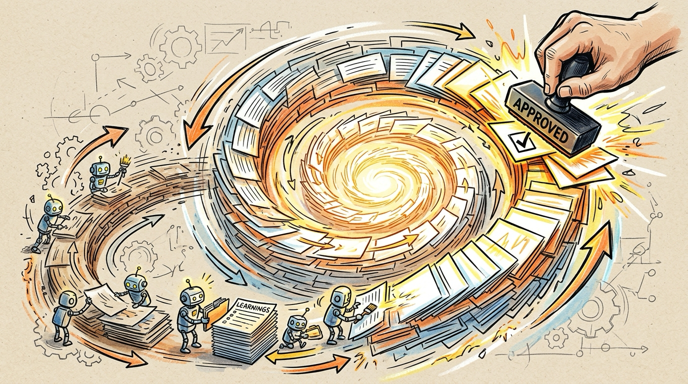

<!-- _class: lead -->
<!-- _paginate: false -->

# The AI-native portfolio

## A PDLC your agents can run

**Agents do the legwork. Humans keep the decisions. The portfolio learns every cycle.**

Yuval Yeret · github.com/yyeret/portfolio-pdlc



---

## The problem: your portfolio runs on reported progress



Forty slides. Every initiative green. And everyone knows slide 23 has been green for five months.

- **Status is a claim, not evidence.** The evidence lives in repos, usage data, and discovery findings nobody collects in time.
- **Decisions wait** — the most expensive queue in the company.
- Leadership responds by **adding process**: more gates, more reports, more committees. *Full gas in neutral.*

> Watermelon initiatives: green outside, red inside.

---

## What changed: two shifts converged

**1. Coding agents got good enough to do the portfolio legwork.**
Walking the board, verifying statuses, sniffing initiatives, prepping decision briefs — the facilitator work that never scaled.

**2. Delivery converged on spec-driven development (SDD).**
Specs, plans, and status live in plain files agents work against. State is *derived from what exists*, not typed into a tracker.

<br>

> A portfolio deserves the SDD attribute more than a codebase does: every unit of work should leave the system easier to run. Most portfolio processes only ever get heavier.

---

## The approach: the portfolio as files

| | |
|---|---|
| **Cards, not decks** | Each initiative is a markdown card: stage, owner, outcome hypothesis, leading indicators, risks tagged *evidence vs. opinion*, a decision log |
| **A generated board** | A script projects cards into a kanban + flow metrics. Nobody "updates" the board — you regenerate it |
| **Verified stages** | Stage labels are claims until checked against reality. Stale status is how portfolios lie to themselves |
| **Humans decide** | Invest, commit, pivot, kill, reorganize — always human, always on a prepared decision brief |
| **Runs anywhere** | Plain markdown + python3. Claude Code, Codex, Gemini/Antigravity — same behavior |

---

## The lifecycle: common language, not gates



**Explore → Discovery\* → Plan/Commit → Execute → Rollout\* → BAU**

<small>\* optional — skipped by decision, never by habit</small>

Confidence grows through the lifecycle. The question is never *"did the ceremony run?"* It's:

> **"Has confidence grown enough for this stage, backed by evidence rather than opinion?"**

Risk lens: **Desirability · Viability · Feasibility**
Derisking matched to risk: *just do it → ship & measure → discovery → seek alpha*

---

## What each stage means

| Stage | Intent | What you can count on |
|---|---|---|
| **Explore** | Frame the problem — worth investigating? | A real problem, not a solution seeking a sponsor |
| **Discovery\*** | Test the riskiest assumptions, timeboxed | Biggest unknowns tested enough for a real go/no-go |
| **Plan/Commit** | Should we build, and how? | Outcome-oriented roadmap with a confidence range |
| **Execute** | Deliver — *the point of last return* | Unknowns were tested **before** commitment |
| **Rollout\*** | Deploy, stabilize, drive adoption | Value realization measured, not just "shipped" |
| **BAU** | Sustain, enhance, learn | Outcomes read against the hypothesis; surprises loop back honestly |

---

## The operating loop: one cycle, one move

**1** Regenerate the board → **2** Sense → **3** Pick **ONE** move → **4** Execute via the matching skill → **5** Record + ≤1 learning → **6** Log and hand off

### The leverage table (top match wins)

1. **Overdue human decision** → surface it; stop piling work behind it
2. **Broken board** → restore integrity first
3. **Committed money with open risks** → derisk it
4. **Aging item at a decision point** → drive it to the decision
5. …down to: **board is clean** → *earn the right to improve the system itself*

Waiting decisions outrank everything. Committed money outranks ideas. Finishing outranks starting.

---

## Four loops, seven skills

| Loop | Skill | What the agent does |
|---|---|---|
| **Advance** | `-advance` | Grow ONE initiative's confidence toward its next decision; write the brief; stop at the boundary |
| **Strengthen** | `-strengthen` | Turn cards into steering instruments: outcome hypotheses, leading indicators, evidence-tagged assumptions |
| **Improve: process** | `-improve` | Probe the PDLC — skipped discovery? rubber-stamp commits? — capture improvement bets |
| **Improve: topology** | `-improve` | Find the dependency constraint; compare platform/team options; capture bets |

Plus **`-wire`** (stand up a portfolio from what exists), **`-assess`** (evidence-verified read), **`-simulate`** (Monte Carlo what-ifs), and **`sniff-test`** diagnostics.

---

## How the reinforcing loop happens



Every cycle leaves the system sharper:

1. **Cards get stronger** — upgrading what every later read steers on
2. **Learnings accumulate** — ≤1 per cycle, filed where the next cycle finds them
3. **Probes fire on real data** — recurring findings become **improvement bets** with kill criteria, never impulse edits
4. **Bets get derisked** — probe, pilot, or **simulation** — then humans adopt at plan-commit
5. **The operating model improves** — riding the same board it manages. *Walk the talk.*

---

## Simulation: discovery for improvement bets

The simulator learns stage durations from **your own flow history** and runs what-ifs: WIP limits, intake shaping, dependency-tax reduction.

From the bundled example portfolio:

| Scenario | Cycle time P50 | Throughput /yr | Verdict |
|---|---|---|---|
| Baseline | 217d | 14.4 | — |
| Tighten execute WIP 4→3 | 235d | 12.9 | **Parked** — doesn't clear the bar at current load |
| Extract billing platform | 185d | 16.7 | **Earns a real tracer** |

> A simulator that can say *no* to your favorite improvement is worth more than one that always agrees with you. **Learn before you burn.**

---

## How to use it

**Five-minute test drive** — no setup, stdlib python only:

```bash
git clone https://github.com/yyeret/portfolio-pdlc
cd portfolio-pdlc/skills/portfolio-pdlc/example/fiy-portfolio
python3 ../../scripts/portfolio_board.py .
```

Then point your agent at the folder: *"Read AGENTS.md and run one cycle of the operating loop."* Watch which move it picks.

**Wiring your real portfolio:**

1. Point your agent at wherever initiative material lives (decks, exports, folders)
2. It loads `portfolio-pdlc-wire`: inventories, drafts charter + workflow **with you**, creates cards, generates the first board
3. Run loop cycles on any cadence — manually or via your harness's goal loop

---

<!-- _class: lead -->

# What this isn't

**Not governance on autopilot.**
Every decision boundary requires a dated entry naming a human.

**Not a framework to install.**
A minimally viable process around the behaviors that matter — with the evidence for the hard conversations on the table every week, without anyone building a deck.

<br>

**github.com/yyeret/portfolio-pdlc** · yuvalyeret.com/contact
